# Operationalizing Machine Learning - Pipeline Automation

## Overview

The project uses the Bank Marketing dataset described in the next section. It leverages *Azure Auto ML* to train multiple models with different algorithms and hyperparameters. The model selection is based on accuracy metric. The best model is deployed for production usages.

In order to mimic real-world production environments, the training is done on a *cluster compute* configured with 4 nodes while the deployed model is served by *Azure Container Instance (ACI)* for the sake of simplicity of this prototype.

Production-ready bells and whistles like *logging facility* and *API documentation* are enabled. *Apache Benchmark* is also used to monitor endpoint consumption in order to maintain reasonable performance.

For best integrating with other systems when new data arrive and retrains are needed, the whole training process is packaged into a *pipeline* and made available as *Azure pipeline endpoints* so enterprise wide applications can invoke it easily.

## Dataset

The dataset was originated from [UCI Data Repository](https://archive.ics.uci.edu/ml/datasets/bank+marketing) but also hosted on [Microsoft Azure Open Dataset](https://automlsamplenotebookdata.blob.core.windows.net/automl-sample-notebook-data/bankmarketing_train.csv).

The data is related with direct marketing campaigns of a Portuguese banking institution. The marketing campaigns were based on phone calls. Often, more than one contact to the same client was required, in order to access if the product (bank term deposit) would be ('yes') or not ('no') subscribed.

**Dataset details:**

Input variables:

*Bank client data:*

1. age (numeric)
2. job: type of job (categorical: 'admin.', 'blue-collar', 'entrepreneur', 'housemaid', 'management', 'retired', 'self-employed', 'services', 'student', 'technician', 'unemployed', 'unknown')
3. marital: marital status (categorical: 'divorced', 'married', 'single', 'unknown'; note: 'divorced' means divorced or widowed)
4. education (categorical: 'basic.4y', 'basic.6y', 'basic.9y', 'high.school', 'illiterate', 'professional.course', 'university.degree', 'unknown')
5. default: has credit in default? (categorical: 'no', 'yes', 'unknown')
6. housing: has housing loan? (categorical: 'no', 'yes', 'unknown')
7. loan: has personal loan? (categorical: 'no', 'yes', 'unknown')

*Related with the last contact of the current campaign:*

8. contact: contact communication type (categorical: 'cellular', 'telephone')
9. month: last contact month of year (categorical: 'jan', 'feb', 'mar', ..., 'nov', 'dec')
10. day_of_week: last contact day of the week (categorical: 'mon', 'tue', 'wed', 'thu', 'fri')
11. duration: last contact duration, in seconds (numeric). Important note: this attribute highly affects the output target (e.g., if duration=0 then y='no'). Yet, the duration is not known before a call is performed. Also, after the end of the call y is obviously known. Thus, this input should only be included for benchmark purposes and should be discarded if the intention is to have a realistic predictive model.

*Other attributes:*

12. campaign: number of contacts performed during this campaign and for this client (numeric, includes last contact)
13. pdays: number of days that passed by after the client was last contacted from a previous campaign (numeric; 999 means client was not previously contacted)
14. previous: number of contacts performed before this campaign and for this client (numeric)
15. poutcome: outcome of the previous marketing campaign (categorical: 'failure', 'nonexistent', 'success')

*Social and economic context attributes:*

16. emp.var.rate: employment variation rate - quarterly indicator (numeric)
17. cons.price.idx: consumer price index - monthly indicator (numeric)
18. cons.conf.idx: consumer confidence index - monthly indicator (numeric)
19. euribor3m: euribor 3 month rate - daily indicator (numeric)
20. nr.employed: number of employees - quarterly indicator (numeric)

Output variable (desired target):

21. y - has the client subscribed a term deposit? (binary: 'yes', 'no')
    
## Architectural Diagram

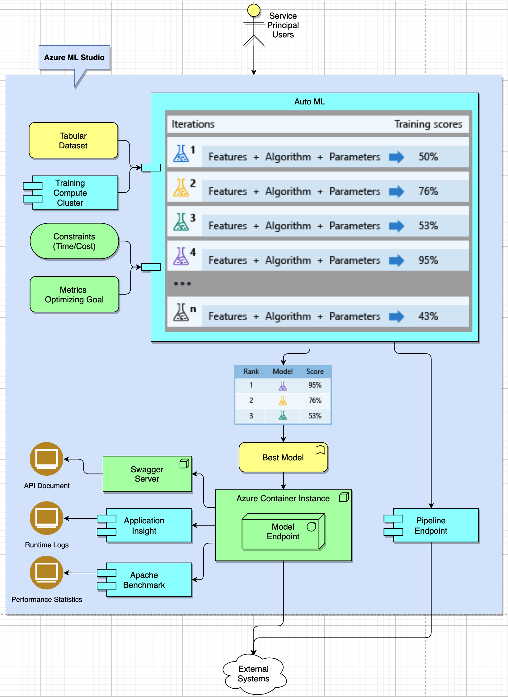

1. **Service Principal users**: granted access to Azure ML Studio can interact with the ML workspace via Web UI or Azure CLI.
   
2. **Auto ML process**: configured with:
   + **Tabular Dataset**: Bank Marketing dataset
   + **Training Computer Cluster**: 4 node, CPU based Azure training cluster
   + **Constraints**: run the experiment within 20 minutes
   + **Metrics Optimizing Goal**: use '*accuracy*' metric to optimize and identify the best model performance

    The Auto ML process applies different feature engineering techniques upon the dataset,  runs it through different ML algorithms/hyperparameters, then use the accuracy metric to pick the best model.

3. **Azure Container Instance (ACI)**: hosts the best model and expose the model prediction capability as a REST webservice which can be consumed at scale.
   
   Azure *Application Insight* can be hooked into ACI to collect logs for troubleshooting and performance monitoring.

4. *Swagger documentation*: Registered model also come with Swagger documentation in JSON format which can be fed to *Swagger Server* for detail usage of the REST APIs along with sample intputs/outputs

5. *Apache Benchmark*: the *ab* command can be run against the REST endpoints to measure performance benchmark

6. *Pipeline Endpoint*: The whole training process is eventually encapsulated into an Azure pipeline and exposed as another REST webservice. When new data arrive and are merged into the train dataset, the training pipeline can be triggered automatically by invoking the endpoint directly.

7. *External Systems*: other line of business applications can leverage both types of endpoints to obtain predictions for their businesses

## Key Steps

1. Dataset: Before dataset can be used in the Auto ML process, it must be transfered to Azure platform:
   
   * Import and register:
   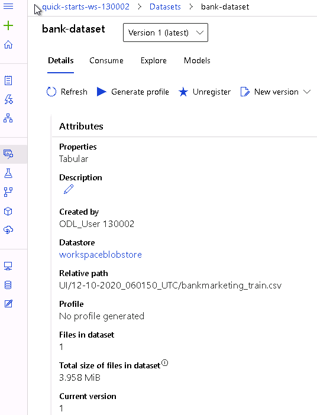

   * Verify dataset: Make sure the dataset imported properly with correct column names and data types:
   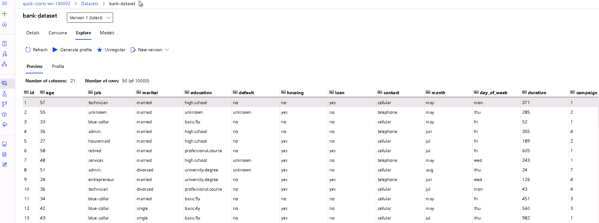

   Having the dataset on Azure comes with huge advantages: 
   
   * Improving performance: Centralizes it in one place for multiple processes, leverages high networking throughputs, and shares easily among the teams

   * Versioning: Helps managing and tracking dataset used for different training experiments and production deployments

   * Profiling: Allows exploring the dataset from different perspectives:  distributions, missing values, and a vast statistical analysis, etc.
  
2. Configure Auto ML run: Every ML project should kick off an Auto ML run to find the baseline before any tweaks, improvements by domain experts, data scientists, and ML engineers:
   
   * Pick dataset: Use the newly registered dataset:
   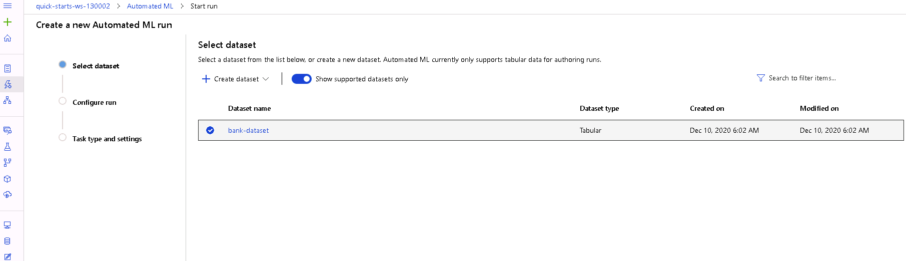
   
   * Specify target column: Output values on column y will be used as the target field.
   
   * Assign compute: A training cluster with 4 CPU based nodes will be used:
   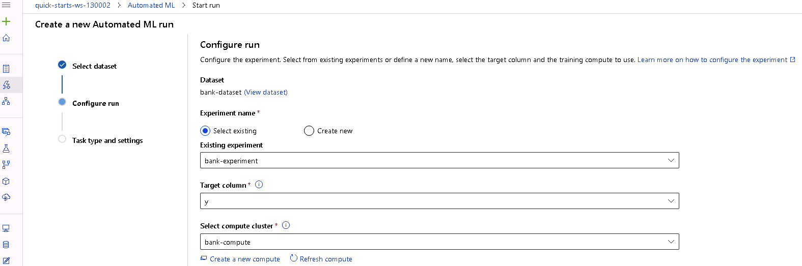
   
   * Select ML task type: In this case, Classification algorithms will be examined:
   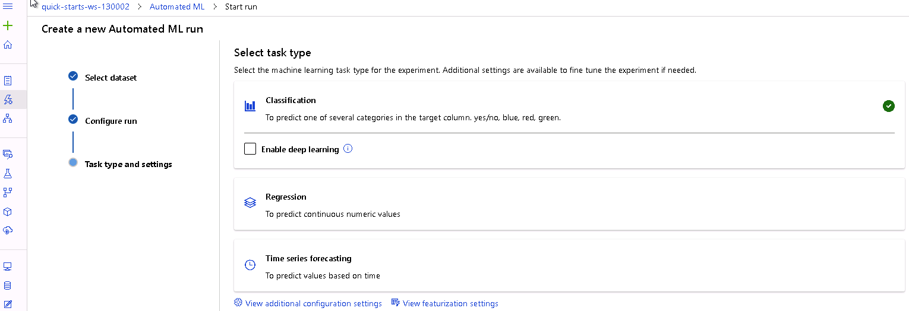
   
   * Set primary metric and other running conditions: Accuracy metric will be used for model optimization. Max concurrent iterations will be 4 since the training cluster has 4 nodes. In order to reduce waiting time and to save resources, try the run for an hour:
   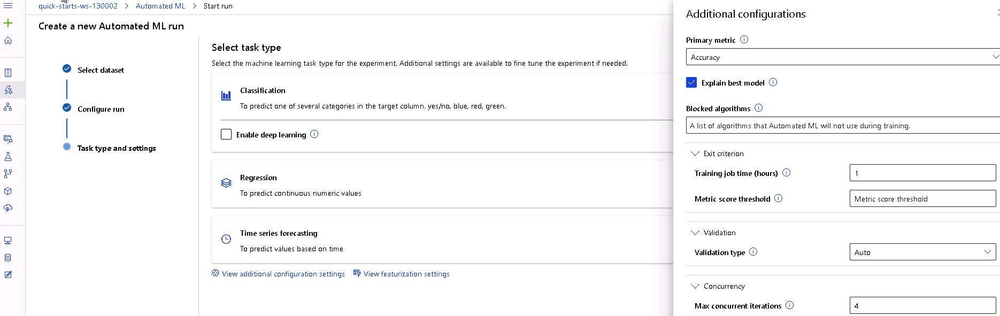

      *Explain best model* option should be enabled in order to gain more insights about the selected best model.
   
   * Run: Start the training run and wait for its completion:
   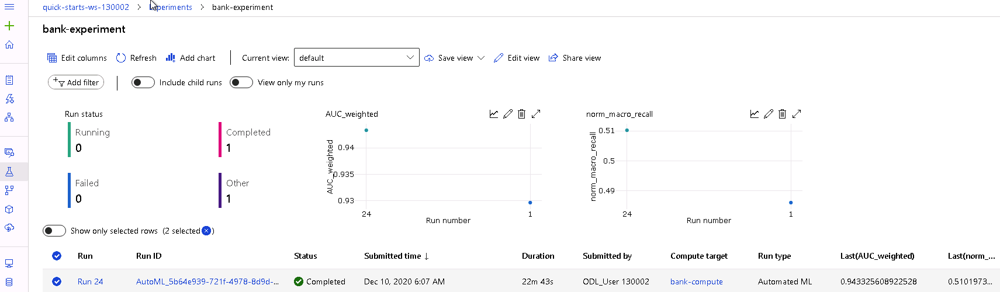
   
   * Pick the best model: Select the best model which has highest accuracy score which is showed on the top of the list:
   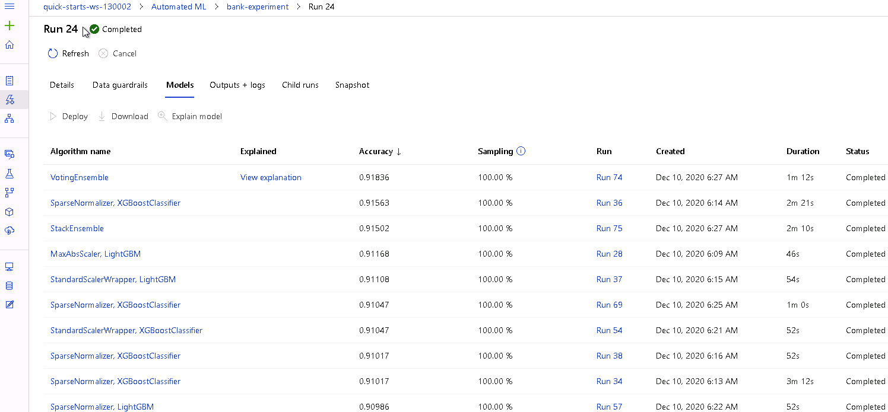
   
   * Review the best model details:
   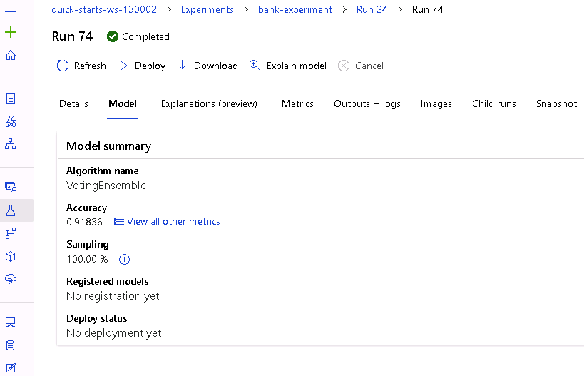

      Beside the accuracy, other useful metrics like AUC, ROC, precision/recall, and model explanation provide great views how the best model selected and what are the most important features. These will help the team better understanding and clues to improve the model down the road:
      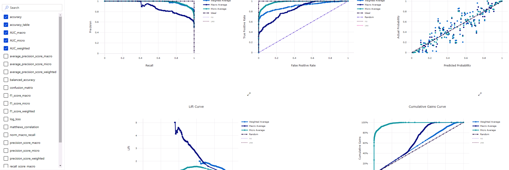
      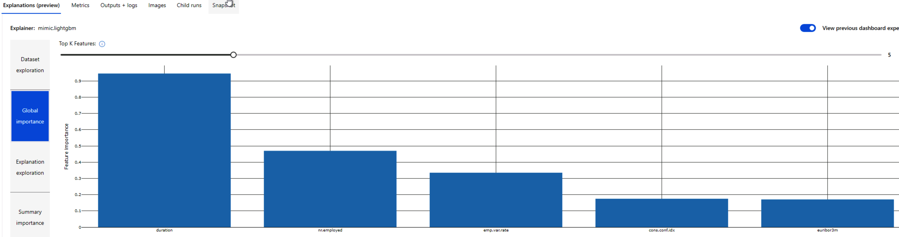

3. Deploy the best model: Up to this point, the best model we obtained is just an experiment, it needs to be deployed to production before it can be widely used for predictions:
   
   * Specify compute type: ACI is used in this prototype for the sake of simplicity:
   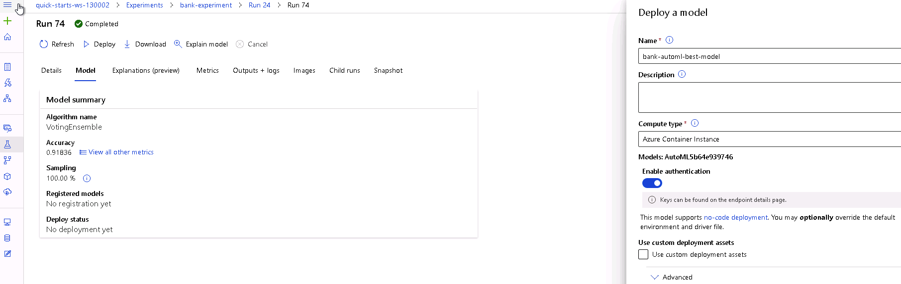

   * Take note of the REST endpoint: After the model is deployed successfully, the endpoint can be used to make predictions (scoring):
   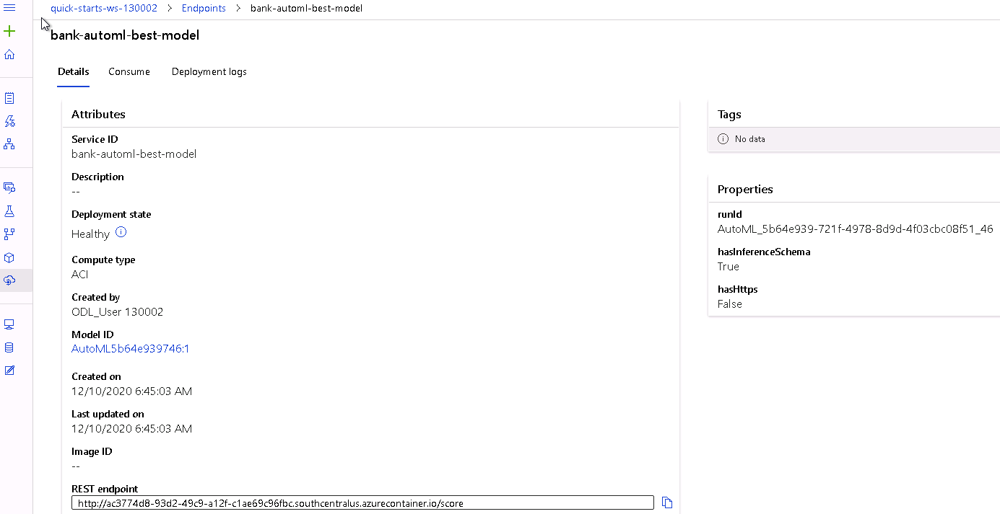

   The model is hosted on either ACI or AKS similarly as any web services, it exposes REST API endpoints for external systems to consume and make predictions.

4. Application Insight: Logging is a crucial part to maintain healthy production environments. It helps monitor performance, detects bottlenecks, troubleshoots real time issues in order to proactively prevents system failures.
    
   * Enable logging: Azure Application Insight can be connected to the ACI/AKS inference clusters via code and web UI:
   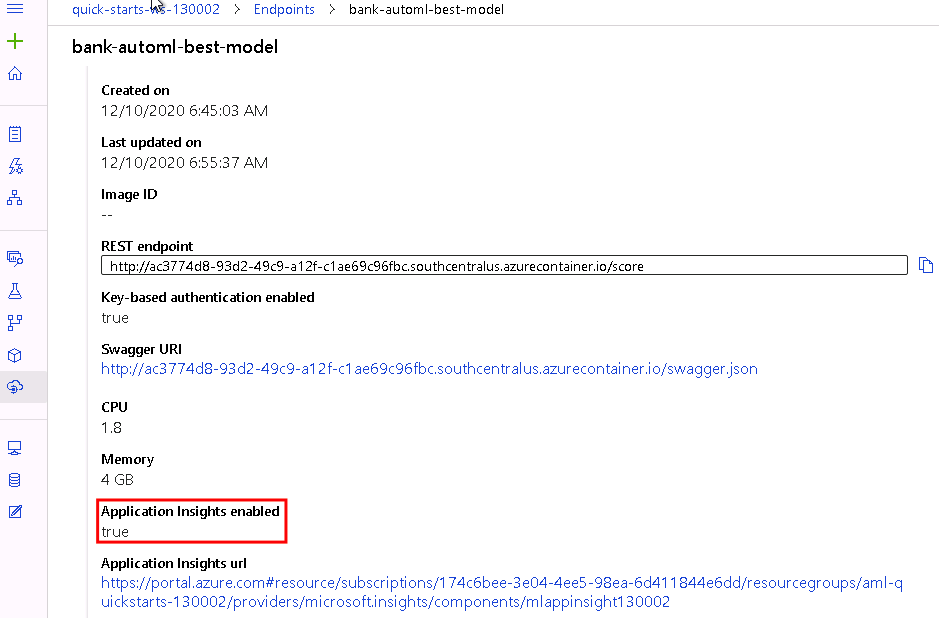

   * Collect logs: Sample code to retrieve logs from Application Insight:
   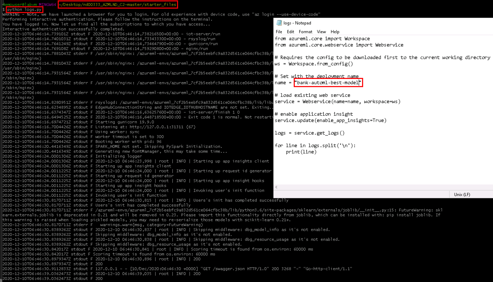

   * View logs in Azure ML Studio: Application Insight comes with rich feature dashboard to view and filter logs:
   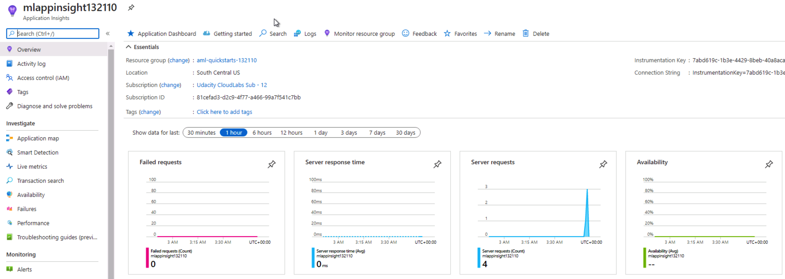

   Azure Application Insight facilitates logging capability and view options of ML production environments the same way as any web applications which DevOps are already familiar with. It is very important in the enterprise settings.

5. Swagger - API documentation: Swagger is the standardized way to document REST API in the industry. It provides universally recognized web interface to show endpoints inputs, outputs, and how to use them.

   * Download Swagger documentation: Azure generates API documentation for every deployed model in JSON format. It can be viewed in Swagger:
   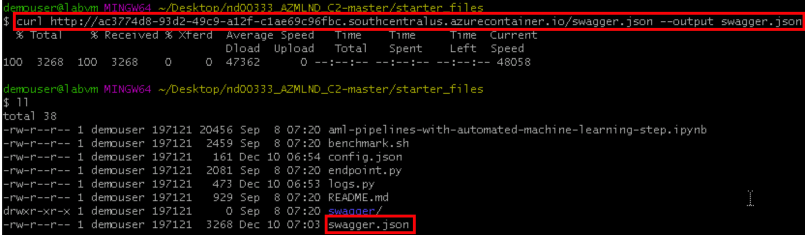

   * Start Swagger server: Run an instance of Swagger server Docker image:
   

   * Start serve.py: In order to feed the JSON file to the Swagger server, a little Python code is needed to bypass CORS restriction from Azure:
   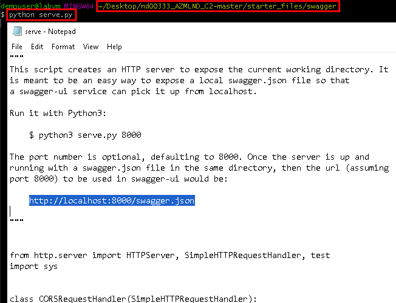

   * Examine API: Load the JSON content from the serve.py into Swagger UI for 'score' endpoint details:
   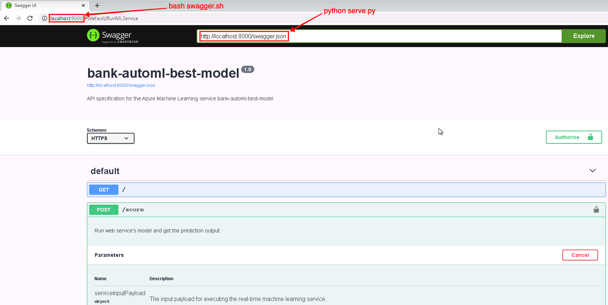
   
   Having the Swagger documentation of a deployed model API for free is a huge advantage from Azure. It can be distributed among the enterprise for easy integration.

6. Consume endpoints: With model capability available as REST endpoints, making predictions is just simple as sending HTTP POST requests to its endpoint along with predictors as inputs, the predictions are sent back as HTTP POST responses. Any application can leverage the model.

   * Postman: Can be used to invoke the 'score' endpoint for making predictions based on different input parameters:
   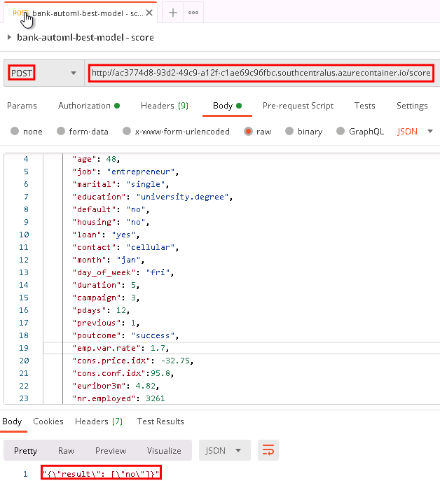

   * Code: The endpoint can be consumed programmatically by Python code:
   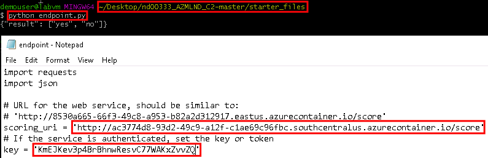

   REST APIs are widely accepted and provides standard communication in software development. The APIs are safe and protected under Azure umbrella.

7. Apache Benchmark: With model predictions exposed as REST APIs, their performance can be measured by any DevOps preferable benchmark tools. Apache Benchmark 'ab' command is a great CLI based tool for this job.
   
   * Send requests: The 'ab' command sends 10 requests with input values from the data.json to the 'score' endpoint:
   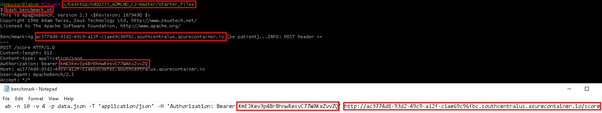

   * Benchmark results: Since 'ab' run with verbose level 4, the performance statistic is pretty much details:
   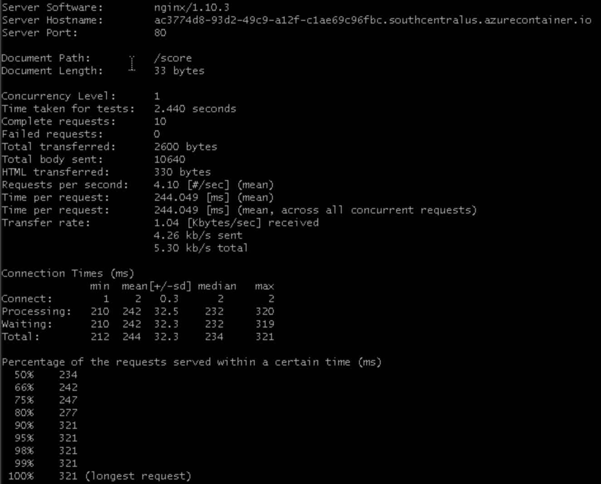

   ML/DevOps usually benchmark the ML production system to be proactive in identifying and preventing potential problems.

8. Pipeline: is a great way to encapsulate different complex stages within a ML project starting from data collection/preparation, feature engineering, train/retrain, test, validation to final deployment. Piplelines can be exposed as REST endpoints as well:
   
   * Create new pipeline: The previous Auto ML run can be registered into a pipeline endpoint by Python code in a Jupyter notebook:
   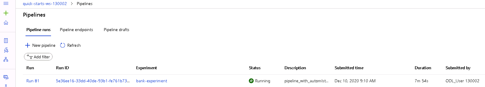

      ```
      run_id = 'AutoML_410bac5f-9a0a-4c34-a77e-41df825022a0'
      pipeline_run = PipelineRun(experiment, run_id)

      published_pipeline = pipeline_run.publish_pipeline(
         name="Bankmarketing Train", 
         description="Training bankmarketing pipeline", 
         version="1.0")
      ```

      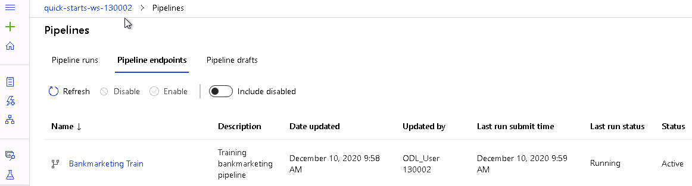

   * New REST endpoint: The new pipeline exposes new REST API enables external systems to invoke it as needed:
   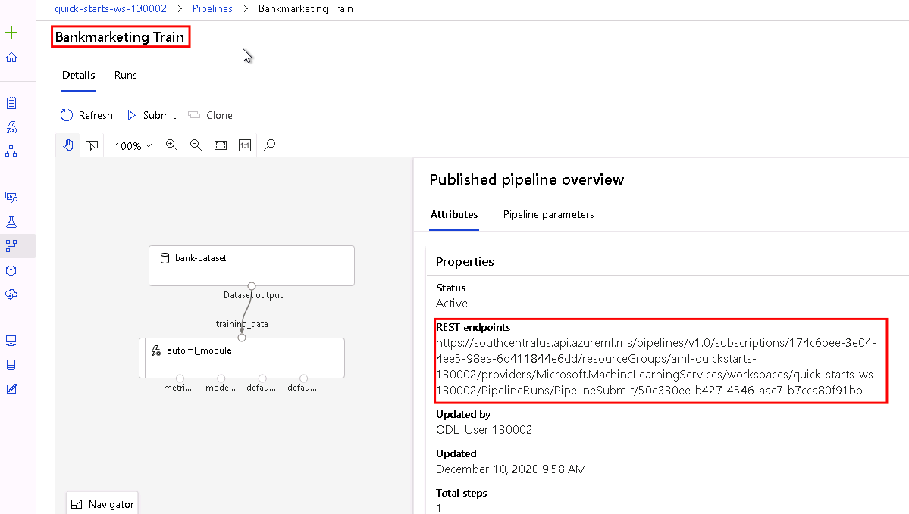

   * Rerun the pipeline: Invoke the REST API to rerun the Auto ML training process embedded in the registered pipeline:
   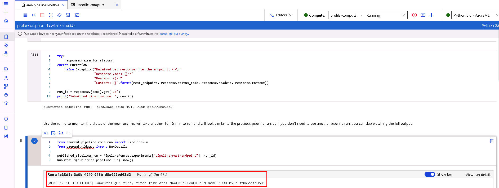
   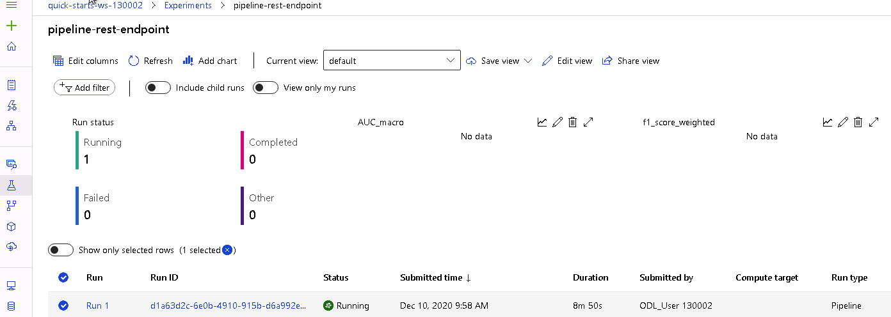

   An ML project can have many pipelines which include different steps depending on the business needs. They make things extremely easy to trigger pipeline runs on demand.

## Screen Recording
Check out the YouTube videos:
   * [5 minute version](https://youtu.be/fY2vrtI1OPY)
   * [15 minute version](https://youtu.be/EvA9q2OJkxs)

## Future Improvements

1. Search for better best model by:
   
   * Extend training time to to 3 or 5 hours
   * Enable GPU train cluster and deep learning option

2. Try the whole project running on local computer
   
3. Deploy the best model to AKS instead of ACI
   
4. Implement data injection to accept new datapoints and retrain model on demand
   
5. Configure data drift

## Standout Suggestions
Check out the project [rubric](https://review.udacity.com/#!/rubrics/2893/view) for more details.