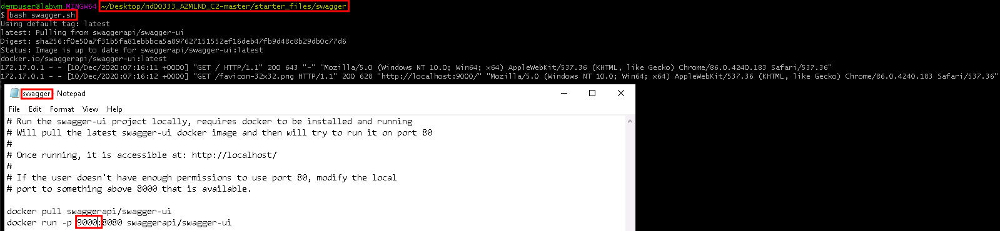

# Operationalizing Machine Learning - Pipeline Automation

## Overview

The project uses the Bank Marketing dataset described in the next section. It leverages *Azure Auto ML* to train multiple models with different algorithms and hyperparameters. The model selection is based on accuracy metric. The best model is deployed for production usages.

In order to mimic real-world production environments, the training is done on a *cluster compute* configured with 4 nodes while the deployed model is served by *Azure Container Instance (ACI)* for the sake of simplicity of this prototype.

Production-ready bells and whistles like *logging facility* and *API documentation* are enabled. *Apache Benchmark* is also used to monitor endpoint consumption in order to maintain reasonable performance.

For best integrating with other systems when new data arrive and retrains are needed, the whole training process is packaged into a *pipeline* and made available as *Azure pipeline endpoints* so enterprise wide applications can invoke it easily.

## Dataset

The dataset was originated from [UCI Data Repository](https://archive.ics.uci.edu/ml/datasets/bank+marketing) but also hosted on [Microsoft Azure Open Dataset](https://automlsamplenotebookdata.blob.core.windows.net/automl-sample-notebook-data/bankmarketing_train.csv).

The data is related with direct marketing campaigns of a Portuguese banking institution. The marketing campaigns were based on phone calls. Often, more than one contact to the same client was required, in order to access if the product (bank term deposit) would be ('yes') or not ('no') subscribed.

**Dataset details:**

Input variables:

*Bank client data:*

1. age (numeric)
2. job: type of job (categorical: 'admin.', 'blue-collar', 'entrepreneur', 'housemaid', 'management', 'retired', 'self-employed', 'services', 'student', 'technician', 'unemployed', 'unknown')
3. marital: marital status (categorical: 'divorced', 'married', 'single', 'unknown'; note: 'divorced' means divorced or widowed)
4. education (categorical: 'basic.4y', 'basic.6y', 'basic.9y', 'high.school', 'illiterate', 'professional.course', 'university.degree', 'unknown')
5. default: has credit in default? (categorical: 'no', 'yes', 'unknown')
6. housing: has housing loan? (categorical: 'no', 'yes', 'unknown')
7. loan: has personal loan? (categorical: 'no', 'yes', 'unknown')

*Related with the last contact of the current campaign:*

8. contact: contact communication type (categorical: 'cellular', 'telephone')
9. month: last contact month of year (categorical: 'jan', 'feb', 'mar', ..., 'nov', 'dec')
10. day_of_week: last contact day of the week (categorical: 'mon', 'tue', 'wed', 'thu', 'fri')
11. duration: last contact duration, in seconds (numeric). Important note: this attribute highly affects the output target (e.g., if duration=0 then y='no'). Yet, the duration is not known before a call is performed. Also, after the end of the call y is obviously known. Thus, this input should only be included for benchmark purposes and should be discarded if the intention is to have a realistic predictive model.

*Other attributes:*

12. campaign: number of contacts performed during this campaign and for this client (numeric, includes last contact)
13. pdays: number of days that passed by after the client was last contacted from a previous campaign (numeric; 999 means client was not previously contacted)
14. previous: number of contacts performed before this campaign and for this client (numeric)
15. poutcome: outcome of the previous marketing campaign (categorical: 'failure', 'nonexistent', 'success')

*Social and economic context attributes:*

16. emp.var.rate: employment variation rate - quarterly indicator (numeric)
17. cons.price.idx: consumer price index - monthly indicator (numeric)
18. cons.conf.idx: consumer confidence index - monthly indicator (numeric)
19. euribor3m: euribor 3 month rate - daily indicator (numeric)
20. nr.employed: number of employees - quarterly indicator (numeric)

Output variable (desired target):

21. y - has the client subscribed a term deposit? (binary: 'yes', 'no')
    
## Architectural Diagram

1. **Service Principal users**: granted access to Azure ML Studio can interact with the ML workspace via Web UI or Azure CLI.
   
2. **Auto ML process**: configured with:
   + **Tabular Dataset**: Bank Marketing dataset
   + **Training Computer Cluster**: 4 node, CPU based Azure training cluster
   + **Constraints**: run the experiment within 20 minutes
   + **Metrics Optimizing Goal**: use '*accuracy*' metric to optimize and identify the best model performance

    The Auto ML process applies different feature engineering techniques upon the dataset,  runs it through different ML algorithms/hyperparameters, then use the accuracy metric to pick the best model.

3. **Azure Container Instance (ACI)**: hosts the best model and expose the model prediction capability as a REST webservice which can be consumed at scale.
   
   Azure *Application Insight* can be hooked into ACI to collect logs for troubleshooting and performance monitoring.

4. *Swagger documentation*: Registered model also come with Swagger documentation in JSON format which can be fed to *Swagger Server* for detail usage of the REST APIs along with sample intputs/outputs

5. *Apache Benchmark*: the *ab* command can be run against the REST endpoints to measure performance benchmark

6. *Pipeline Endpoint*: The whole training process is eventually encapsulated into an Azure pipeline and exposed as another REST webservice. When new data arrive and are merged into the train dataset, the training pipeline can be triggered automatically by invoking the endpoint directly.

7. *External Systems*: other line of business applications can leverage both types of endpoints to obtain predictions for their businesses

## Key Steps

1. Dataset: Before dataset can be used in the Auto ML process, it must be transfered to Azure platform:
   
   * Import and register:
   

   * Verify dataset: Make sure the dataset imported properly with correct column names and data types:
   

2. Configure Auto ML run:
   
   * Pick dataset: Use the newly registered dataset:
   
   
   * Specify target column: Output values on column y will be used as the target field.
   
   * Assign compute: A training cluster with 4 CPU based nodes will be used:
   
   
   * Select ML task type: In this case, Classification algorithms will be executed:
   
   
   * Set metric and other running conditions: Accuracy metric will be used for model optimization. Max concurrent iterations will be 4 since the training cluster has 4 nodes. In order to reduce waiting time and to save resources, try the run for an hour:
   
   
   * Run: Start the training run and wait for its completion:
   
   
   * Pick the best model: Select the best model which has highest accuracy score which is showed on the top of the list:
   
   
   * Review the best model details:
   

3. Deploy the best model:
   
   * Specify compute type: ACI is used in this prototype:
   

   * Take note of the REST endpoint: After the model is deployed successfully, the endpoint can be used to make predictions (scoring):
   

4. Application Insight - Logging:
   * Enable logging: Azure Application Insight can be connected to the ACI/AKS inference clusters via code and web UI:
   

   * Collect logs: Sample code to retrieve logs from Application Insight:
   

5. Swagger - API documentation:

   * Download Swagger documentation: Azure generates API documentation for every deployed model in JSON format. It can be viewed in Swagger:
   

   * Start Swagger server: Run an instance of Swagger server Docker image:
   

   * Start serve.py: In order to feed the JSON file to the Swagger server, a little Python code is needed to bypass CORS restriction from Azure:
   

   * Examine API: Load the JSON content from the serve.py into Swagger UI for 'score' endpoint details:
   
   
6. Consume endpoints:

   * Postman: Can be used to invoke the 'score' endpoint for making predictions based on different input parameters:
   

   * Code: The endpoint can be consumed programmatically by Python code:
   

7. Apache Benchmark:
   
   * Send requests: The 'ab' command sends 10 requests with input values from the data.json to the 'score' endpoint:
   

   * Benchmark results: Since 'ab' run with verbose level 4, the performance statistic is pretty much details:
   

8. Pipeline:
   
   * Create new pipeline: The previous Auto ML run can be registered into a pipeline endpoint by Python code in a Jupyter notebook:
   
   

   * New REST endpoint: The new pipeline exposes new REST API enables external systems to invoke it as needed:
   

   * Rerun the pipeline: Invoke the REST API to rerun the Auto ML training process embedded in the registered pipeline:
   
   

## Screen Recording
Check out the [YouTube video](https://youtu.be/EvA9q2OJkxs).

## Standout Suggestions
Check out the project [rubric](https://review.udacity.com/#!/rubrics/2893/view) for more details.